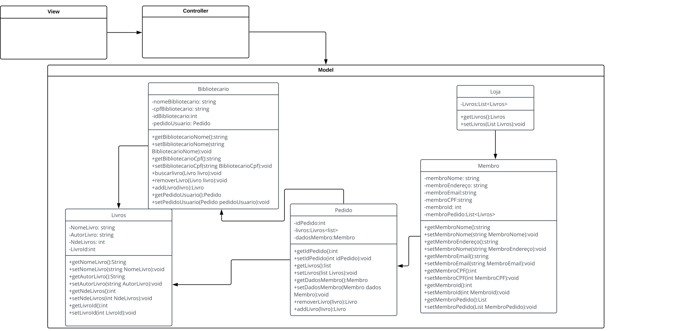

<h1>Exercicio 1 </h1>

"We see three critical differences between programming and software engineering: time, scale, and the trade-offs at play.
On a software engineering project, engineers need to be more concerned with the passage of time and the eventual need for change.
In a software engineering organization, we need to be more concerned about scale and efficiency, both for the software we produce as well as for the organization that is producing it.
Finally, as software engineers, we are asked to make more complex decisions with higher-stakes outcomes, often based on imprecise estimates of time and growth. Within Google, we sometimes say,
“Software engineering is programming integrated over time.” Programming is certainly a significant part of software engineering: after all, programming is how you generate new software in the first place.
If you accept this distinction, it also becomes clear that we might need to delineate between programming tasks (development) and software engineering tasks (development, modification, maintenance).
The addition of time adds an important new dimension to programming. Cubes aren’t squares,
distance isn’t velocity.
Software engineering isn’t programming." Titus Winters, Software Engineering at Google

R1: São poucas diferenças que diferem um engenheiro de software de um programador, porém tais diferenças são cruciais.
Um engenheiro de software pensa no sentido do futuro, um exemplo é o pensamento de como um software vai se degradar com
o tempo, como se tal língua de programação será útil daqui a alguns anos, além disso o engenheiro tem que pensar na 
quantidade de usuários que irá utilizar o tal software. em si um engenheiro de software também é um programador,
mas é ele faz outras diversas coisas além de programar

<h1>Exercicio 2 </h1>
R2: O trade off no nosso api é a versatilidade que o nosso software apresenta, poderíamos realizar uma aplicação web 
o que deixaria o acesso e uso muito mais facil, porém, deixaria o software "preso" a essa função, criando um software 
desktop deixará o cliente com mais possibilidades de uso, como controle de estoque entre outras coisas. Ou seja o trade
off seria um acesso e uso mais facil pela versatilidade do software

<h1>Exercicio 3</h1>

  <b>Livraria</b> 
  O usuário deve ser capaz de adicionar, remover e pesquisar por livros de sua propria escolha.
  

<h3> Requisitos funcionais (tarefas ou as ações do sistema):</h3>

<ul>
  <li>Conseguir reservar livros, independente da quantia</li>
  <li>Conseguir ver descrições basicas sobre os itens;</li>
  <li>Ser capaz de realizar buscas a partir de palavras chave, como:Autor, nome do livro, etc;</li>
</ul>

<h3>Requisitos não funcionais (qualidades do sistema):</h3>

<ul>
  <li>Design simples e intuitivo;</li>
  <li>Diversidade de itens a venda;</li>
</ul>

<h2> UML </h2>
 

